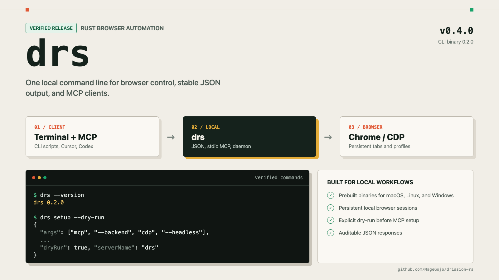

# drission

A Rust browser automation library with the `drs` CLI and local MCP server for scripts and AI clients.

[](https://crates.io/crates/drission)
[](https://docs.rs/drission)
[](https://www.rust-lang.org)
[](#compatibility)
[](LICENSE)

[简体中文](README.md) · **English** · [API docs](https://docs.rs/drission) · [Changelog](CHANGELOG.md)

`drission` provides an asynchronous, `tokio`-based browser control API. Its default Chrome DevTools
Protocol backend supports Chrome, Edge, Brave, Chromium, and Electron. The `drs` binary exposes the
same foundation through a command-line interface, a JSON protocol, and a local MCP server for test
tools, data-processing scripts, and AI coding clients.

> [!IMPORTANT]
> Use this project only on systems you own or are explicitly authorized to test. Follow applicable
> laws, site terms, access controls, `robots.txt`, and rate limits. Do not use it to bypass
> authentication or security controls, access accounts without authorization, collect protected
> data, or conduct attacks or harassment. See [Responsible use](#responsible-use) and [LICENSE](LICENSE).



## Choose an interface

| Interface | Best for | Get started |
|---|---|---|
| `drission` | Browser control in a Rust application | Use the pinned v0.4.0 Git command below |
| `drs` CLI | Terminal or script use with stable JSON output | Download a prebuilt Release binary |
| `drs` MCP | Local browser tools for Cursor, Codex, and other MCP-compatible clients | Install `drs`, then run `drs setup` |

## Quick start

### Rust library

The current repository and Release version is **v0.4.0**. Chromium/CDP is enabled by default.
The crates.io `drission` package is currently still at 0.3.2, so the commands below pin the
published Git tag:

```bash
cargo add drission --git https://github.com/MageGojo/drission-rs --tag v0.4.0
```

```toml
[dependencies]
drission = { git = "https://github.com/MageGojo/drission-rs", tag = "v0.4.0" }
tokio = { version = "1", features = ["full"] }
```

```rust
use drission::prelude::*;

#[tokio::main]
async fn main() -> drission::Result<()> {
    let browser = Browser::launch(BrowserOptions::new().headless(true)).await?;
    let tab = browser.new_tab(Some("https://example.com")).await?;

    println!("title: {:?}", tab.title().await?);
    println!("h1: {:?}", tab.ele_text("h1").await?);

    browser.quit().await?;
    Ok(())
}
```

Run the minimal repository example:

```bash
cargo run --example cdp_demo
```

The default backend detects a locally installed Chromium-family browser. See
[Chrome download](docs/Chrome自动下载.md) and [server deployment](docs/服务器部署.md) for browser
selection, managed downloads, and headless environments.

### `drs` CLI and MCP

The recommended installation path is a prebuilt `drs` binary with its SHA-256 checksum from
[GitHub Releases](https://github.com/MageGojo/drission-rs/releases/tag/v0.4.0) or
[GitCode Releases](https://gitcode.com/Roufsi/drission-rs/releases). It does not require a Rust
toolchain.

You can also build and install from the published Git tag. This command was verified with
`drs 0.2.0`:

```bash
cargo install --git https://github.com/MageGojo/drission-rs --tag v0.4.0 drission-cli --bin drs
```

The crates.io `drission-cli` package is currently still at 0.1.0; do not omit `--git` when installing
the CLI that accompanies v0.4.0. Installer scripts are also available under [`install/`](install/);
inspect a script before executing it.

Common commands:

```bash
drs ensure-serve --backend cdp --headless
drs --json open https://example.com
drs ax --outline
drs screenshot --out page.png --full
```

Preview MCP configuration changes before applying them:

```bash
drs setup --dry-run
drs setup
```

`drs setup` merges the Cursor project configuration and Codex user configuration without replacing
other MCP servers. By default, MCP connects to a persistent local browser process so tabs and browser
configuration can survive MCP process restarts. See the [CLI / MCP guide](docs/CLI.md) and
[persistent browser guide](docs/mcp-持久浏览器.md) for commands, JSON responses, tools, and manual setup.

## Core capabilities

- **Asynchronous browser control:** navigation, locators, clicking, typing, keyboard input, scrolling,
  file uploads, iframes, Shadow DOM, and multiple tabs.
- **Page and network observation:** HTML, text, screenshots, PDF, console events, WebSocket events,
  XHR / Fetch monitoring, and request interception.
- **Accessibility and recording:** accessibility-tree snapshots and authorized interaction recording
  to Rust or JSON action sequences.
- **Concurrency and recovery:** browser pools, proxy health checks, retry policies, and checkpoints.
- **Local tool interfaces:** CLI, a JSONL daemon, and stdio MCP for integration with other languages
  and local AI clients.
- **Runtime governance:** profile leases, cooldowns, failure classification, risk records, and ledger
  queries for auditable automation jobs.
- **Optional visual components:** offline OCR and image-position analysis for owned or explicitly
  authorized test environments.

## Features

| Feature | Contents | Default |
|---|---|---|
| `cdp` | CDP backend for Chrome, Edge, Brave, Chromium, and Electron | Yes |
| `camoufox` | Camoufox / Firefox Juggler compatibility backend | No |
| `ocr` | Offline text recognition using `tract` | No |
| `slider` | Image-position analysis for authorized tests; enables `camoufox` | No |
| `signer` | Embedded QuickJS for local JavaScript compatibility testing | No |
| `impersonate` | HTTP client compatibility profiles; requires CMake and a C toolchain | No |

Example configurations:

```toml
# Default CDP backend with OCR
drission = { git = "https://github.com/MageGojo/drission-rs", tag = "v0.4.0", features = ["ocr"] }

# Camoufox backend only
# drission = { git = "https://github.com/MageGojo/drission-rs", tag = "v0.4.0", default-features = false, features = ["camoufox"] }
```

Refer to [Cargo.toml](Cargo.toml) and the [API documentation](https://docs.rs/drission) for the
authoritative feature dependency and build requirements.

## Compatibility

| Item | Supported range |
|---|---|
| Rust | 1.85 or newer, edition 2024 |
| Operating systems | macOS, Linux, Windows |
| Default backend | Chromium / CDP |
| Default browser selection | Google Chrome first; Edge, Brave, Chromium, and Electron are also supported |
| Optional backend | Camoufox / Firefox Juggler |

Use headless mode on systems without a desktop. See [server deployment](docs/服务器部署.md) for
container and Linux system dependencies.

## Documentation and examples

- [Documentation index](docs/README.md): architecture, deployment, network observation, pools, and API mapping.
- [CLI / MCP](docs/CLI.md): `drs` commands, JSON protocol, MCP tools, and configuration.
- [Examples](examples/README.md): runnable examples and commands grouped by capability.
- [DrissionPage API mapping](docs/API映射.md): corresponding Rust APIs for Python users.
- [API reference](https://docs.rs/drission): types, methods, and feature markers.
- [Changelog](CHANGELOG.md): release features and compatibility changes.
- [Contributing guide](CONTRIBUTING.md) and [security policy](SECURITY.md).

## Responsible use

Browser automation can process login state, personal data, copyrighted material, or operations with
real business impact. Before deployment:

1. Access only systems, accounts, and data that you own or have explicit written authorization to use.
2. Follow applicable laws, contracts, platform terms, `robots.txt`, access controls, and rate limits.
3. Do not bypass paywalls, authentication, CAPTCHAs, or other security controls; do not evade bans or impersonate others.
4. Do not collect personal, confidential, copyrighted, or restricted data without the right to process it; minimize collected data.
5. Put write, publish, purchase, and delete operations behind isolated tests, least privilege, and human confirmation.
6. Protect browser profiles, cookies, logs, screenshots, and exports; do not commit sensitive data to version control.

Optional OCR, image analysis, browser configuration, and network observation features do not grant
permission to access any third-party system. Third-party names and trademarks belong to their
respective owners; their mention does not imply endorsement, affiliation, or warranty.

This section describes project usage boundaries. It is not legal advice and does not replace an
assessment for your jurisdiction and use case. Report vulnerabilities privately through
[SECURITY.md](SECURITY.md).

## License

This project uses a custom **source-available, non-commercial license**. It is not an OSI-approved
open-source license. Personal learning and lawful nonprofit use must comply with every term in
[LICENSE](LICENSE). Commercial use, paid redistribution, or using the project as a core component of
a paid product or service requires prior written authorization from the copyright holder.

Users remain responsible for evaluating their use case. The license and disclaimers do not exclude
liability that cannot be excluded under applicable law.

## Acknowledgements

- [DrissionPage](https://github.com/g1879/DrissionPage): API design reference.
- [Camoufox](https://github.com/daijro/camoufox): optional browser backend.
- [ddddocr](https://github.com/sml2h3/ddddocr): OCR model source.
- [tract](https://github.com/sonos/tract): Rust ONNX inference engine.

Maintained by [API Zero](https://apizero.cn).
