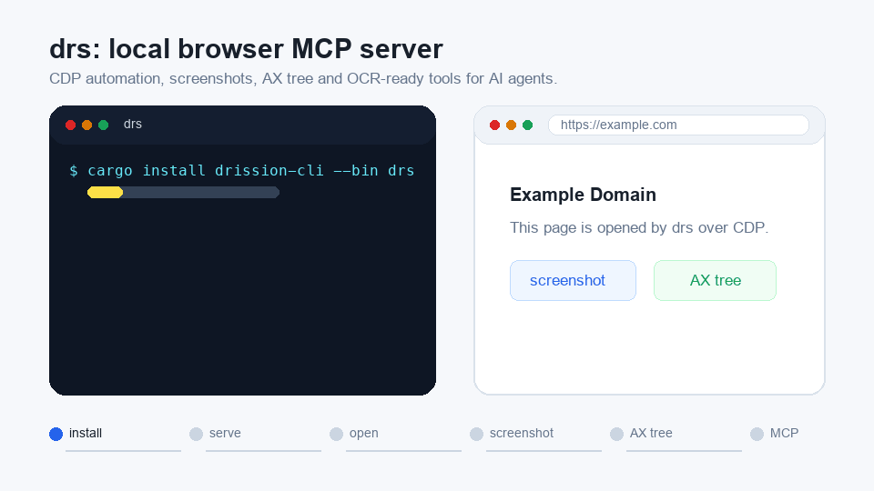

# drission

Rust 浏览器自动化库，以及面向本地脚本和 AI 客户端的 `drs` CLI / MCP 服务。

[](https://crates.io/crates/drission)
[](https://docs.rs/drission)
[](https://www.rust-lang.org)
[](#兼容性)
[](LICENSE)

**简体中文** · [English](README.en.md) · [API 文档](https://docs.rs/drission) · [更新日志](CHANGELOG.md)

`drission` 提供基于 `tokio` 的异步浏览器控制 API，默认通过 Chrome DevTools Protocol
驱动 Chrome、Edge、Brave、Chromium 和 Electron。仓库内的 `drs` 则把相同能力提供为命令行、
JSON 协议和本地 MCP 服务，适合测试工具、数据处理脚本和 AI 编程客户端调用。

> [!IMPORTANT]
> 本项目仅用于您拥有或已获明确授权的系统。请遵守适用法律、网站条款、访问控制、
> `robots.txt` 和频率限制。不得用于绕过身份验证或安全控制、未授权访问账户、采集受保护数据，
> 或实施攻击与骚扰。完整边界见[负责任使用](#负责任使用)和 [LICENSE](LICENSE)。



## 选择入口

| 入口 | 适用场景 | 开始使用 |
|---|---|---|
| `drission` | 在 Rust 程序中控制浏览器 | `cargo add drission@0.4` |
| `drs` CLI | 从终端或脚本调用浏览器，获得稳定 JSON 输出 | `cargo install drission-cli --bin drs` |
| `drs` MCP | 为 Cursor、Codex 等兼容 MCP 的本地客户端提供浏览器工具 | 安装 `drs` 后运行 `drs setup` |

## 快速开始

### Rust 库

当前版本为 **0.4.x**，默认启用 Chromium / CDP 后端：

```toml
[dependencies]
drission = "0.4"
tokio = { version = "1", features = ["full"] }
```

```rust
use drission::prelude::*;

#[tokio::main]
async fn main() -> drission::Result<()> {
    let browser = Browser::launch(BrowserOptions::new().headless(true)).await?;
    let tab = browser.new_tab(Some("https://example.com")).await?;

    println!("title: {:?}", tab.title().await?);
    println!("h1: {:?}", tab.ele_text("h1").await?);

    browser.quit().await?;
    Ok(())
}
```

运行仓库内的最小示例：

```bash
cargo run --example cdp_demo
```

默认会探测本机已安装的 Chromium 系浏览器。浏览器选择、自动下载和服务器部署方式见
[Chrome 自动下载](docs/Chrome自动下载.md)与[服务器部署](docs/服务器部署.md)。

### `drs` CLI 与 MCP

使用 Cargo 安装：

```bash
cargo install drission-cli --bin drs
```

不安装 Rust 工具链时，可从 [GitHub Releases](https://github.com/MageGojo/drission-rs/releases)
下载对应平台的预编译文件。仓库也提供 [`install/`](install/) 下的安装脚本；执行前请先检查脚本内容。

常用命令：

```bash
drs ensure-serve --backend cdp --headless
drs --json open https://example.com
drs ax --outline
drs screenshot --out page.png --full
```

接入 MCP 客户端前可先预览配置变更：

```bash
drs setup --dry-run
drs setup
```

`drs setup` 会合并 Cursor 项目配置和 Codex 用户配置，不覆盖其中的其他 MCP 服务。
服务默认连接本机常驻浏览器进程，使标签页和浏览器配置可以跨 MCP 进程重启保留。
完整命令、JSON 响应格式、MCP 工具列表与手动配置方法见 [CLI / MCP 文档](docs/CLI.md)
和[持久浏览器说明](docs/mcp-持久浏览器.md)。

## 核心能力

- **异步浏览器控制**：导航、元素定位、点击、输入、键盘、滚动、文件上传、iframe、Shadow DOM 和多标签页。
- **页面与网络观测**：HTML、文本、截图、PDF、控制台、WebSocket、XHR / Fetch 监听与请求拦截。
- **可访问性与录制**：无障碍树快照，以及将已授权的交互录制为 Rust 或 JSON 操作序列。
- **并发与恢复**：浏览器池、代理健康检查、重试策略和断点检查点。
- **本地工具接口**：`drs` 提供 CLI、JSONL daemon 和 stdio MCP，便于不同语言或本地 AI 客户端集成。
- **运行时治理**：profile 租约、冷却、失败分类、风险记录和 ledger 查询，用于可审计地管理自动化任务。
- **可选视觉组件**：离线 OCR 与图像位置分析，仅应用于自有或明确授权的测试环境。

## Features

| Feature | 内容 | 默认启用 |
|---|---|---|
| `cdp` | Chrome / Edge / Brave / Chromium / Electron 的 CDP 后端 | 是 |
| `camoufox` | Camoufox / Firefox Juggler 兼容后端 | 否 |
| `ocr` | 基于 `tract` 的离线文字图像识别 | 否 |
| `slider` | 授权测试环境中的图像位置分析；自动启用 `camoufox` | 否 |
| `signer` | 内嵌 QuickJS，用于本地 JavaScript 兼容性测试 | 否 |
| `impersonate` | HTTP 客户端兼容性配置；需要 CMake 与 C 编译工具链 | 否 |

示例配置：

```toml
# 默认 CDP 后端并启用 OCR
drission = { version = "0.4", features = ["ocr"] }

# 仅使用 Camoufox 后端
# drission = { version = "0.4", default-features = false, features = ["camoufox"] }
```

各 feature 的依赖关系与构建要求以 [Cargo.toml](Cargo.toml) 和
[API 文档](https://docs.rs/drission)为准。

## 兼容性

| 项目 | 支持范围 |
|---|---|
| Rust | 1.85 及以上，edition 2024 |
| 操作系统 | macOS、Linux、Windows |
| 默认后端 | Chromium / CDP |
| 默认浏览器 | 优先探测 Google Chrome，同时支持 Edge、Brave、Chromium 和 Electron |
| 可选后端 | Camoufox / Firefox Juggler |

无桌面环境可使用 headless 模式。容器及 Linux 系统依赖见[服务器部署](docs/服务器部署.md)。

## 文档与示例

- [文档索引](docs/README.md)：架构、部署、网络监听、并发池和 API 映射。
- [CLI / MCP](docs/CLI.md)：`drs` 命令、JSON 协议、MCP 工具与配置。
- [示例索引](examples/README.md)：按功能分类的可运行示例与命令。
- [DrissionPage API 映射](docs/API映射.md)：从 Python API 查找 Rust 对应写法。
- [API 参考](https://docs.rs/drission)：类型、方法和 feature 标记。
- [更新日志](CHANGELOG.md)：发布版本的功能与兼容性变化。
- [贡献指南](CONTRIBUTING.md)与[安全策略](SECURITY.md)。

## 负责任使用

浏览器自动化可能处理登录状态、个人信息、受版权保护的内容或会产生真实业务影响的操作。
在部署前，请至少确认以下事项：

1. 仅访问您拥有或已获得明确书面授权的系统、账户与数据。
2. 遵守适用法律、合同、平台条款、`robots.txt`、访问控制和频率限制。
3. 不绕过付费墙、身份验证、验证码或其他安全控制，不规避封禁或冒充他人身份。
4. 不采集无权处理的个人、机密、受版权保护或其他受限制数据；遵循数据最小化原则。
5. 对写入、发布、购买、删除等操作使用隔离测试环境、最小权限和人工确认。
6. 妥善保护浏览器 profile、Cookie、日志、截图和导出文件，避免把敏感数据提交到版本库。

可选的 OCR、图像分析、浏览器配置和网络观测能力不构成访问任何第三方系统的授权。
项目名称及文档中提及的第三方商标归各自权利人所有，不代表其认可、合作或担保。

本节是项目使用边界说明，不构成法律意见，也不能替代针对具体业务和司法辖区的专业评估。
如发现安全问题，请按 [SECURITY.md](SECURITY.md) 使用私密渠道报告。

## 许可证

本项目采用自定义的 **source-available、非商业许可**，不是 OSI 认可的开源许可证。
个人学习和合法非盈利使用须同时满足 [LICENSE](LICENSE) 的全部条款；商业使用、付费再分发、
将本项目作为付费产品或服务的核心等情形，需要事先取得版权持有人的书面授权。

使用者应自行评估其具体用途是否合规。许可证与免责声明不能排除适用法律下不可排除的责任。

## 致谢

- [DrissionPage](https://github.com/g1879/DrissionPage)：API 设计参考。
- [Camoufox](https://github.com/daijro/camoufox)：可选浏览器后端。
- [ddddocr](https://github.com/sml2h3/ddddocr)：OCR 模型来源。
- [tract](https://github.com/sonos/tract)：Rust ONNX 推理引擎。

由[极数本源](https://apizero.cn)维护。
